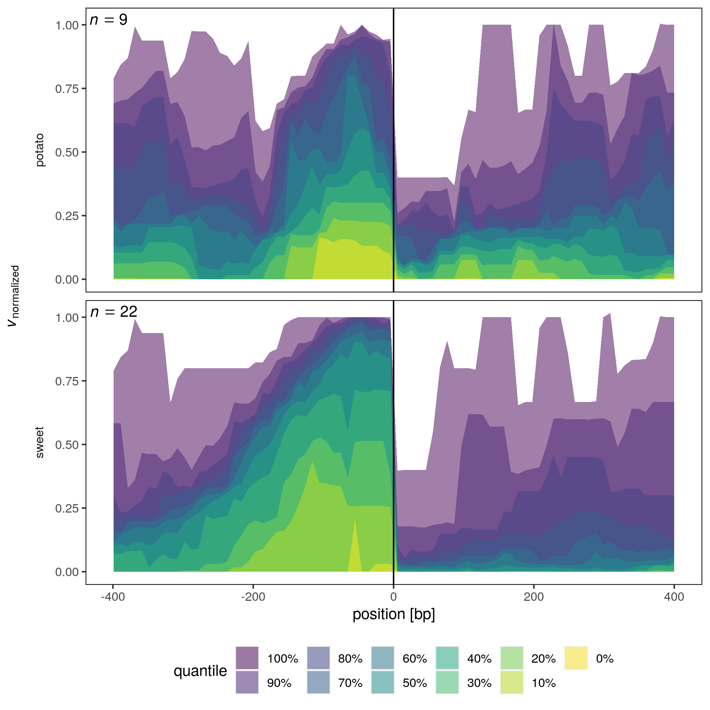

# quantile-intervals

`bedtools` and `tidyverse` workflow to calculate the distribution of a normalized variable for each position within genomic intervals.

<p align="center">

</p>

## Notes
* Run the script:

```
nextflow main.nf
```
* Script was developed especially for the distribution of a variable around a specific position.
  + Intervals get aligned at their centers. Is is not necessary that they are of equal length. However, they should be aligned correctly to enable the detection of distributional differences.
* For input formats consult the example.
  + bedgraphs must be reported with the depth at each genome position (e.g. see `bedtools genomecov -d`).
  + Example data was taken from Dar and Sorek (2018).
* Different normalization strategies are implemented and can be set within the file `main.nf`.
* Workflow is rather slow at the moment. This is due to the usage of bedgraphs with a base-pair resolution.

## Requirements
* `nextflow >= 21.04.3.5560`
* `bedtools >= 2.27.1`
* `R >= 4.1.2`
* `tidyverse >= 1.3.1`
* `reshape2 >= 1.4.4`
